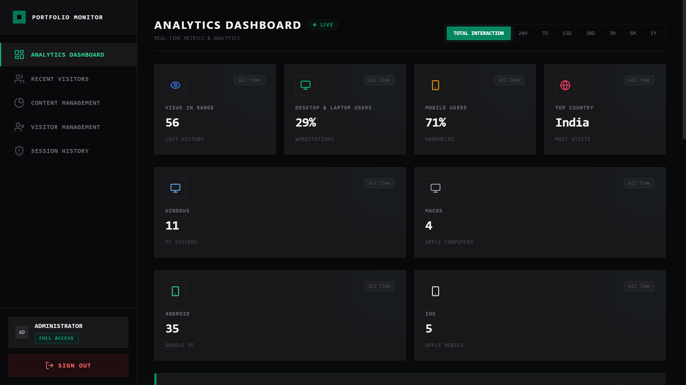
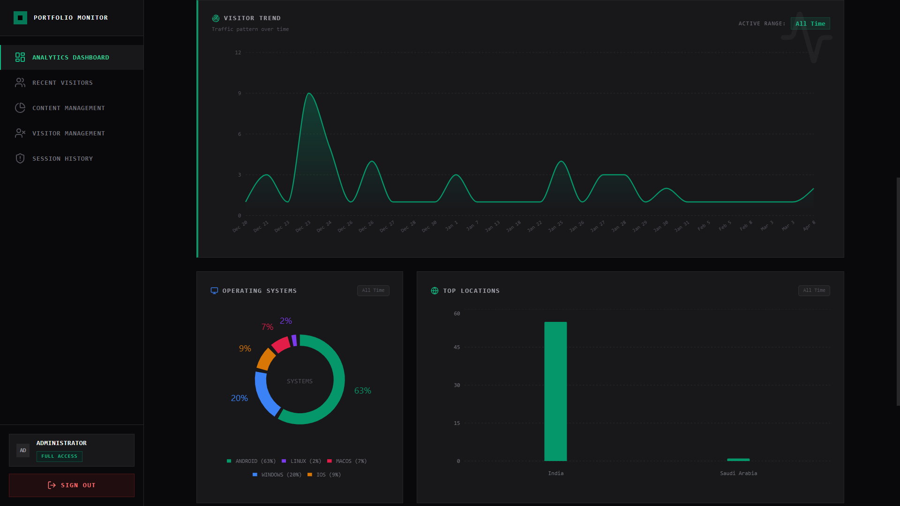
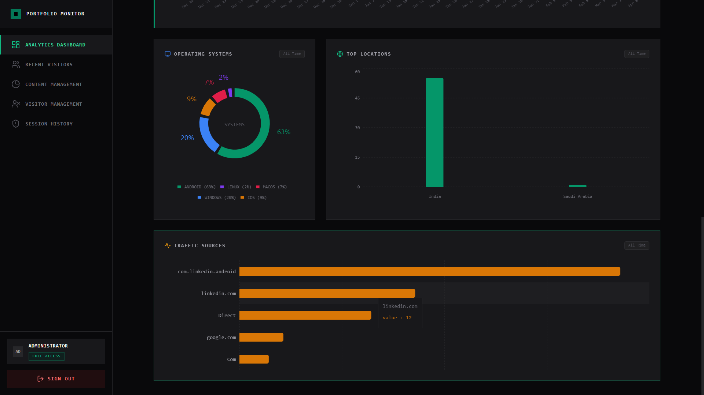
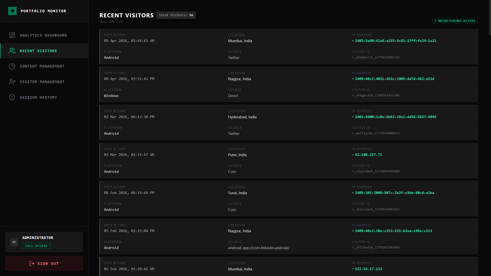
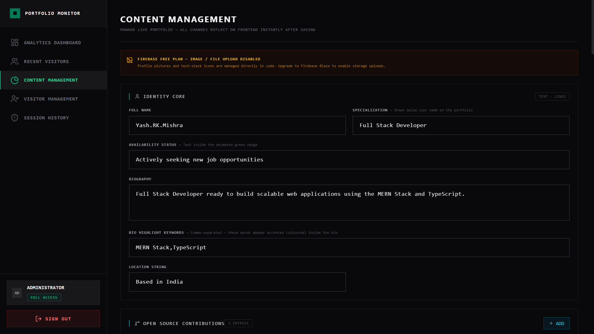
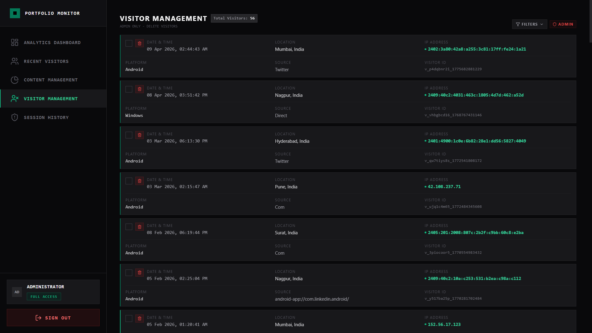
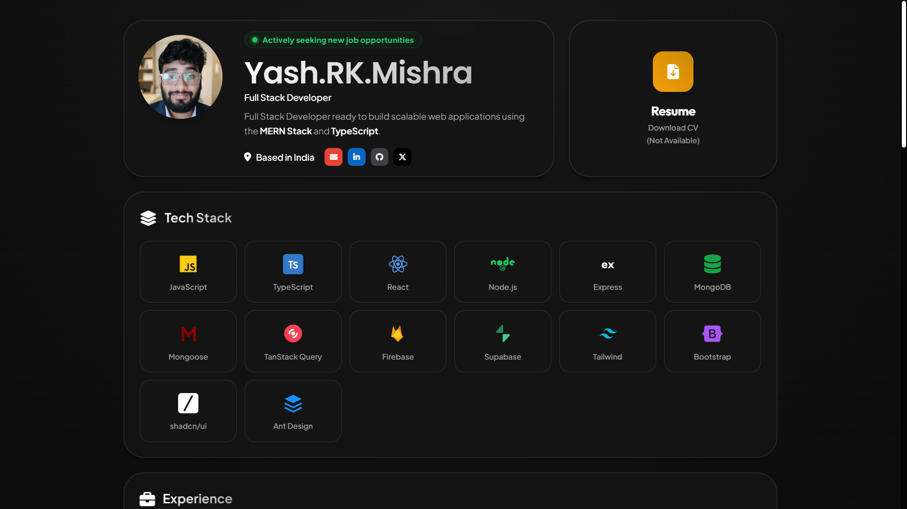
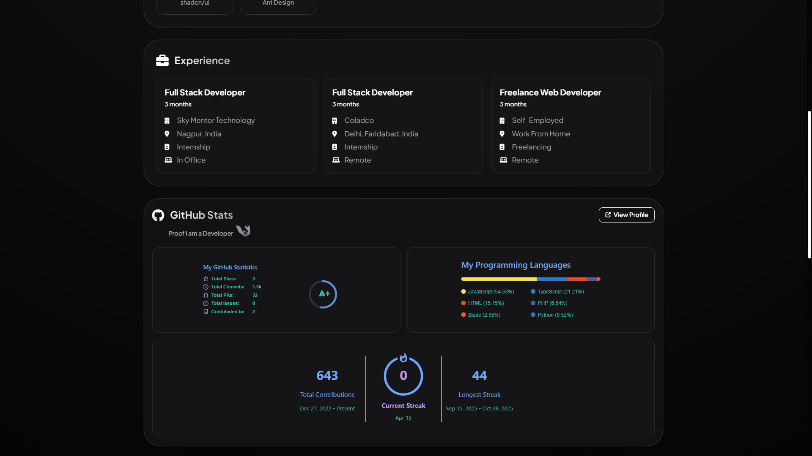
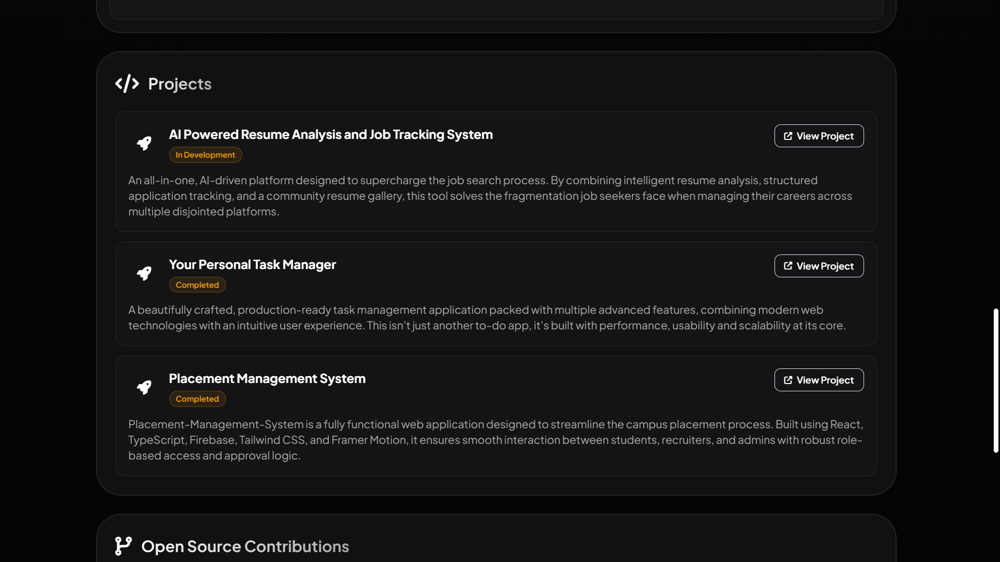
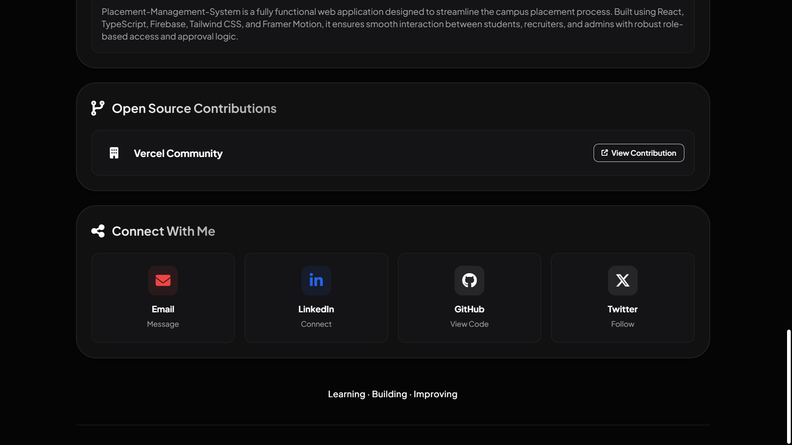

<div align="center">

# Portfolio-Website-With-Analytics-Dashboard
**A professional, dual-application system combining a high-speed public portfolio with a secure, real-time analytics and content management dashboard.**

[](https://react.dev)
[](https://vitejs.dev)
[](#)
[](https://firebase.google.com)
[](https://pnpm.io)
[](https://opensource.org/)

*“The goal is to turn data into information, and information into insight.”*

</div>

---

## 📸 Visual Preview

<div align="center" style="display: flex; flex-wrap: wrap; gap: 2%; justify-content: center;">
  
  
  
  
  

  
  

  
  

  
  
</div>

---

## 📖 Overview

This repository contains a full-stack, integrated system built to serve as my personal developer portfolio while showing modern coding practices. Instead of relying on third-party services like Google Analytics or hardcoding content, I built a custom system. 

It consists of two main applications built within a PNPM workspace:
1. A **high-speed public portfolio** that silently tracks visitor data.
2. A private, secure **Dashboard** that shows traffic in real-time and acts as a Content Management System (CMS) to update the public site instantly.
3. **PWA Integration:** Install the system on both mobile (Android/iOS) and desktop (Windows/Mac) for a native experience with offline support.

---

## ✨ Key Features

Based on the actual implementation, the system provides:

### 🌐 The Public Portfolio
In the frontend section of the portfolio website, I have included my experience, GitHub account, projects, open-source contributions, social media profiles, resume, and an ‘About Me’ section. If you would like to add or modify anything, you have full freedom to do so.

- **Dynamic Content:** All profile data, bios, projects, and experiences sync in real-time from Firestore.
- **Silent Data Tracking:** Automatically captures visitor info including location, Operating System, hardware type, and referral links.
- **Modern UX:** Built with a dark-mode-first aesthetic using Tailwind CSS, featuring subtle scroll-reveal animations and a **fully responsive** bento-grid layout optimized for all device sizes.

---

### 🛡️ The Dashboard (Control Center)
A fully private, high-security control panel built to monitor and manage the entire portfolio. It is securely locked behind Firebase Authentication and a custom two-factor security key.

#### A. Analytics Dashboard (Grouped Data)
The Analytics engine provides clear insights into visitor information and how they use the site:
- **Device & OS Info:** Detailed lists of visitor hardware like MacBook, Windows, Linux, Android, and iOS devices.
- **Location Mapping:** Shows where visitors are coming from across the world.
- **Activity Trends:** Clear graphs showing when users are most active (highs and lows).
- **Traffic Sources:** Analysis of where visitors found your link, such as LinkedIn, X, Google, or other sites.

#### B. Recent Visitors (Real-Time List)
A live feed of visitor information for quick monitoring:
- **Live Metrics:** Shows the exact visit time, IP address, and device type.
- **Appoximate Location:** Shows City and Country based on IP address. 
  > **Note:** This location is an estimation based on IP and may not be 100% exact.

#### C. Content Management (Live Edit)
A simple interface that lets the owner control **~95% of the frontend portfolio** without any coding or new deployments:
- **Text Control:** Quickly update bios, skills, project notes, and work experience.
- **Section Visibility:** Hide or show entire sections (like Projects or Tech Stack) instantly.
- **Plan Note:** Due to Firebase Free plan limits, updating images still requires manual changes in the code.

#### D. Visitor Management (Data Control)
Tools to manage and clean up your visitor data:
- **Record Deletion:** Permanently remove specific visitor records or entry history.
- **Data Cleanup:** Helps keep your analytics accurate and relevant.

#### E. Security Audit & Session History
A dedicated section to monitor dashboard logins and ensure the system is safe:
- **Login Tracking:** Detailed logs of every login and logout, including the device, IP, and location used.
- **Active Sessions:** A live list of all current administrative sessions.
- **Security Check:** Allows the owner to see *who* accessed the dashboard and *from where*, preventing any unwanted access.

---

## 💻 Tech Stack

| Category | Technology | Purpose |
|----------|------------|---------|
| **Core Framework** | React 19 & Vite | Lightning-fast HMR and minimal bundle footprint. |
| **Workspace** | PNPM | Shared local dependencies and parallel script execution. |
| **Styling** | Tailwind CSS v3 | Utility-first rapid UI development. |
| **Backend & Database** | Firebase (Firestore + Auth) | Real-time NoSQL document streaming, serverless backend, and encrypted auth. |
| **Data Visualization** | Recharts & D3 | Highly performant geometric data rendering for the dashboard. |
| **Data Tracking** | `ua-parser-js` & IP APIs | Advanced data detection for hardware and location. |

---

## 🏗️ How It Works

This project uses a modern **workspace setup** to keep everything organized.

1. **The Tracking Loop:** When a user visits the public portfolio, a small script captures their device and location data. This is sent silently to Firestore.
2. **The Update System:** The dashboard app stays connected to Firestore. As new data arrives, the dashboard graphs update instantly to show live traffic.
3. **The Content Loop:** When you update your bio or projects in the Dashboard, the changes are saved to Firestore. The public site sees these changes and updates immediately without a page refresh.

---

## 🔐 Security Information

- **Privacy by Design:** There is no "Create Account" or signup page. No one can create an account from the website itself.
- **Manual Account Setup:** Admin logins (Email/Password) must be created directly inside the **Firebase Console**. This keeps your dashboard access private and under your control.
- **Private Login:** The dashboard requires a valid Firebase login to see any page.
- **Extra Security Keys:** For added safety, sensitive actions in the dashboard require a custom "Security Key." This key must be set up manually in your database.
- **Environment Protection:** All API keys are stored in a private `.env` file and are not shared on GitHub.
- **Database Rules:** You must set up Firestore rules so that only you can change the data, keeping it safe from others.

---

## 🧑‍💻 Installation & Setup Guide

Want to run this ecosystem locally? Because this is a configured PNPM workspace, it takes less than two minutes.

### 1. Clone the Repository
```bash
git clone https://github.com/YashMishra0101/Portfolio-Website-With-Analytics-Dashboard.git
cd Portfolio-Website-With-Analytics-Dashboard
```

### 2. Configure Environment Variables
You must provide your own Firebase credentials. Create a `.env` file in the root directory and add:
```bash
VITE_FIREBASE_API_KEY="..."
VITE_FIREBASE_AUTH_DOMAIN="..."
VITE_FIREBASE_PROJECT_ID="..."
VITE_FIREBASE_STORAGE_BUCKET="..."
VITE_FIREBASE_MESSAGING_SENDER_ID="..."
VITE_FIREBASE_APP_ID="..."
```

### 3. Install Dependencies
```bash
pnpm install
```

### 4. Start Development Servers
This will boot up both the Portfolio and Dashboard development servers in parallel.
```bash
pnpm run dev
```

---

## 📖 Usage Instructions

1. **Access the Portfolio:** Navigate to the local URL provided by Vite (usually `http://localhost:5173`) to view the public-facing site.
2. **Access the Dashboard:** Navigate to the dashboard URL (usually `http://localhost:5174`).
3. **Login:** Authenticate using your Firebase credentials.
4. **Manage Content:** Click on the "Content Manager" menu to edit your profile, add projects, or update your experience. Changes will instantly reflect on the portfolio.
5. **View Analytics:** Check the standard dashboard view to see live traffic data as you open and refresh the portfolio in other tabs.

---

## 🤝 Contribution Guidelines

This project was built primarily for personal use. However, if you find bugs or have suggestions for improvements:

1. Fork the repository.
2. Create a feature branch (`git checkout -b feature/AmazingFeature`).
3. Commit your changes (`git commit -m 'Add some AmazingFeature'`).
4. Push to the branch (`git push origin feature/AmazingFeature`).
5. Open a Pull Request.

**Important:** Please ensure any contributions align with the existing workspace architecture and do not compromise the security or performance of the dashboard.

---

## 📜 License

⚠️ **IMPORTANT NOTICE FOR FORKING:**
If you choose to fork or clone this repository to use as your own portfolio, you **MUST completely remove all of the original author's personal information, emails, URLs, and images** before deploying to any environment. You will also need to replace the Firestore document structures with your own data schema. Please read the LICENSE carefully.

<br/>

<div align="center">

### Built by [Yash RK Mishra](https://github.com/YashMishra0101) with AI tools 👨‍💻

[](https://www.linkedin.com/in/yash-mishra-356280223/)
[](https://x.com/YashRKMishra1)

**[⭐ Star this repository to show your support](#)**

</div>